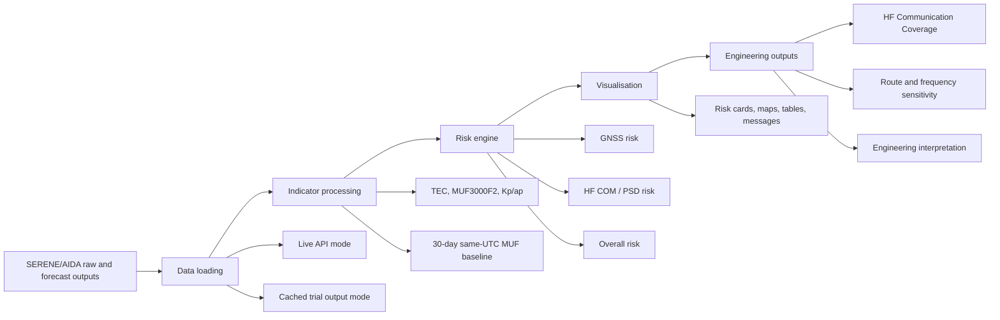

# Aviation Space Weather Dashboard Based on SERENE AIDA Data

This repository contains a Streamlit research prototype that converts SERENE
AIDA ionospheric model outputs into aviation-oriented space weather risk
information.

The main app is in `streamlit_cloud_github/app.py`.

## Aim

Convert SERENE AIDA scientific outputs into aviation-oriented risk information,
including GNSS and HF communication risk categories, maps, summary tables, and
TEST SPWX research messages.

## Main Features

- SERENE AIDA TEC and MUF3000F2 loading
- Kp/ap geomagnetic context
- GNSS risk from Vertical TEC
- HF COM risk from Post-Storm Depression
- Engineering Impact: HF Communication Coverage
- UK transmitter to North Atlantic to New York JFK route assessment
- Frequency sensitivity comparison for 5, 7.5, 10, 15, 17.5 and 20 MHz
- ICAO/PECASUS-style summary table
- Categorical risk maps
- TEST SPWX research messages
- Global default grid for aviation-scale awareness
- Cached trial outputs for faster demonstration
- Live SERENE API mode for new analysis times

## Architecture and Workflow

The project is designed as an Engineering Decision Support prototype rather
than a simple risk display. The dashboard translates SERENE/AIDA scientific
outputs into aviation-oriented indicators, then into HF communication impact
and decision-support interpretation.



The engineering chain is:

```text
Risk Assessment
  -> Communication Impact
  -> Engineering Interpretation
  -> Decision Support
```

The HF engineering module keeps the existing MUF-threshold proxy and labels it
as **Engineering Impact: HF Communication Coverage**. It reports quiet coverage,
storm coverage, coverage loss, quiet/storm route availability, degraded route
points, longest degraded route segment, and a concise interpretation. Frequency
comparison is labelled as research comparison only and must not be used as
operational frequency advice.

## Validation Approach

Validation is organised around the engineering decision-support workflow:

- Historical event replay using cached trial outputs or Live SERENE API mode.
- Quiet vs storm comparison using AIDA `reference_value` when the 30-day
  same-UTC MUF3000F2 baseline is available.
- PSD sensitivity using the fallback PSD slider only when historical comparison
  data is unavailable.
- Frequency sensitivity across 5, 7.5, 10, 12.5, 15, 17.5 and 20 MHz.
- Route assessment verification for the UK transmitter to North Atlantic to New
  York JFK case study.

The Trace feasibility work is documented in `docs/Trace Integration Report.md`.
The dashboard does not fake ray tracing; current HF coverage remains a
MUF-threshold engineering proxy until validated electron-density profiles are
available for Trace.

## Limitations

- Research prototype only
- Not for operational aviation use
- No direct radiation dose product
- No S4 / sigma-phi scintillation input from SERENE-only data
- No direct PCA / SWF product from SERENE-only data
- Forecasts may be official SERENE forecasts or clearly labelled
  dashboard-generated fallback predictions

## Cached Trial Outputs

Cached processed outputs for selected demo / validation periods can be stored in
`streamlit_cloud_github/data/trial_outputs/`. These files are intended to speed
up presentation and validation without repeating every SERENE download.

Live SERENE API loading remains available for new analysis times. Cached output
files must not contain API tokens, Streamlit secrets, raw credentials, or
personal data.
