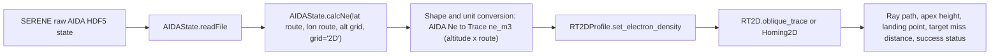

# Trace Integration Report

## Executive conclusion

`hfpytrace` can be used as an experimental engineering extension, but it should
not replace the current dashboard risk logic yet.

The current dashboard correctly uses MUF3000F2 and PSD as an HF communication
proxy. That is not ray tracing. A real Trace integration needs an
altitude-resolved electron-density profile along the UK to North Atlantic route.
AIDA can theoretically calculate electron density (`Ne`) when altitude is
provided, but the current dashboard does not request or store that profile.

Recommendation: support both in stages.

- Keep the current MUF/PSD proxy as the main dashboard feature.
- Add Trace later as an optional experimental case study after the AIDA to Trace
  electron-density converter is validated.
- Do not present Trace outputs as official ICAO operational warnings.

## Sources reviewed

- Trace documentation: https://pytrace.readthedocs.io/en/latest/
- Trace source repository: https://github.com/shibaji7/trace
- AIDA source repository: https://github.com/breid-phys/aida-ionosphere
- Current dashboard repository files:
  - `streamlit_cloud_github/aida_adapter.py`
  - `streamlit_cloud_github/aida_grid.py`
  - `streamlit_cloud_github/data_loader.py`
  - `streamlit_cloud_github/hf_coverage.py`
  - `streamlit_cloud_github/icao_risk.py`
  - `streamlit_cloud_github/serene_client.py`

## What hfpytrace is

`hfpytrace` is a Python-first HF propagation and ray-tracing toolkit. It is used
to build ionospheric electron-density profiles and trace HF radio rays through
that ionosphere.

The main architecture is:

1. Build an ionospheric profile or grid.
2. Provide transmitter, receiver or route information.
3. Choose frequency and launch angles.
4. Run 2D or 3D ray tracing.
5. Inspect ray path, apex height, ground range, group delay and landing status.

The package is useful for this project because it can demonstrate a more direct
engineering effect: whether a selected HF frequency can propagate from a UK
transmitter across the North Atlantic under different ionospheric conditions.

## Supported propagation workflows

| Workflow | What it does | Relevance to this project |
| --- | --- | --- |
| 2D ray tracing (`RT2D`) | Traces rays along one route cross-section. | Best first choice for UK transmitter to North Atlantic demonstration. |
| 2D homing | Searches launch elevation angles that land near a target range. | Useful after the basic 2D route works. |
| 3D ray tracing (`RT3D`) | Traces rays through a geographic 3D ionosphere grid. | More realistic but higher implementation effort. |
| IRI-backed profile | Uses IRI/PyIRI to generate electron density. | Good for proving Trace works, but it is not SERENE/AIDA PSD. |
| Custom electron-density profile | User supplies electron density along route/altitude. | Required for a scientifically honest AIDA integration. |
| Collision/neutral atmosphere support | Adds collision frequency or absorption-related inputs. | Useful later if absorption or signal loss is studied. |

## Required Trace inputs

| Input | Needed by Trace? | Purpose | Current project status | Comment |
| --- | --- | --- | --- | --- |
| Electron density profile | Yes | Main ionosphere input for ray tracing. | △ Requires conversion | AIDA can calculate `Ne` with altitude, but the dashboard does not currently request it. |
| IRI model | Optional | Built-in background ionosphere source. | ✓ Available through hfpytrace dependencies | Good for a proof of concept, but not a SERENE/AIDA PSD result. |
| Altitude grid | Yes | Vertical axis for electron density. | △ Requires new settings | Current app uses lat/lon maps, not altitude profiles. |
| Transmitter location | Yes | Ray origin. | ✓ Available conceptually | Current HF case uses a UK transmitter preset. |
| Receiver or target location | Needed for success testing | Defines target route or landing goal. | ✓ Available conceptually | North Atlantic or New York target can be used. |
| Frequency | Yes | HF operating frequency. | ✓ Available | Current HF case can evaluate selected MHz values such as 17.5 MHz. |
| Launch elevation | Yes | Initial upward ray angle. | ✗ Missing from dashboard | Needs sweep or homing search. |
| Launch azimuth | Required for 3D, implicit for 2D route | Direction of ray launch. | △ Requires conversion | 2D route uses the great-circle route; 3D needs explicit azimuth fan. |
| Route distance axis | Yes for 2D | Horizontal coordinate for profile and ray path. | △ Requires conversion | Current app can generate great-circle route samples. |
| Earth model / radius | Yes | Geometry for propagation. | ✓ Trace default | Can use Trace defaults initially. |
| Geomagnetic model | Often required or recommended | Magnetoionic propagation context. | △ Requires conversion | Trace can use geomagnetic helpers; dashboard does not expose this grid. |
| Collision / neutral atmosphere | Optional but important for absorption | Supports absorption-sensitive modelling. | △ Not currently used | Trace can use NRLMSISE-style inputs. |
| Raw AIDA HDF5 state | Needed for AIDA-backed Trace | Source file for profile calculation. | △ Live only / not stored in demo cache | Current dashboard downloads raw HDF5 in memory, then stores processed outputs. |

## Comparison with current SERENE/AIDA project data

| Data product | Currently used by dashboard? | Can it support Trace directly? | Status |
| --- | --- | --- | --- |
| TEC / vTEC | Yes | No. TEC is vertically integrated and does not define the full altitude profile. | ✓ Available, but not enough |
| MUF3000F2 | Yes | No. It is useful for HF risk interpretation but is not a ray-tracing profile. | ✓ Available, proxy only |
| `foF2` | Supported by lower-level AIDA grid code | Not directly; could help describe F-layer state. | △ Possible supporting input |
| `NmF2` | Supported by lower-level AIDA grid code | Not directly; could help check peak density. | △ Possible supporting input |
| `hmF2` | Supported by lower-level AIDA grid code | Not directly; could help check peak height. | △ Possible supporting input |
| Electron density `Ne` | Not used in dashboard | Yes, if calculated versus altitude and route. | △ Available in AIDA, missing in dashboard pipeline |
| Altitude profiles | Not used in dashboard | Yes. | ✗ Missing from current app outputs |
| Plasma density grids | Not stored in demo outputs | Yes, if shaped correctly. | △ Requires new extraction and cache format |
| Raw HDF5 outputs | Downloaded for live AIDA calculation | Needed for offline conversion. | △ Not preserved in current cached trial outputs |
| Coordinates | Yes | Yes. | ✓ Available |
| Kp/ap | Yes as global context | Not a regional Trace input. | ✓ Context only |

## Required conversion pipeline

The honest AIDA to Trace path is:

Important guardrail:

MUF3000F2 and PSD can motivate the HF case, but they are not enough to produce
a physical ray path. The ray path must come from an electron-density profile or
grid.

## Minimal proof of concept

A standalone proof-of-concept script has been added:

`prototypes/hfpytrace_uk_north_atlantic_poc.py`

Default case:

- Transmitter: UK, 52.0 N, 2.0 W
- Target: North Atlantic point, 51.0 N, 32.0 W
- Frequency: 17.5 MHz
- Backend: IRI through hfpytrace
- Output: ray-path plot and JSON summary

This POC proves that `hfpytrace` can generate real ray paths in a local
standalone workflow. It does not prove that the dashboard can already do
AIDA-backed PSD ray tracing.

The script also includes an experimental `--backend aida` path, but that path is
not validated yet. It requires raw AIDA HDF5 input and a compatible Python
environment where AIDA and hfpytrace can be installed together.

Generated local POC files:

- `prototypes/output/hfpytrace_uk_north_atlantic_result.json`
- `prototypes/output/hfpytrace_uk_north_atlantic_ray_path.png`

## Local feasibility findings

The Trace IRI workflow is technically feasible.

Observed result from a local IRI-based run:

- UK to North Atlantic route length: about 2065 km
- Frequency: 17.5 MHz
- A 5 degree launch elevation returned to ground near the target route distance
- The best ray landed about 28.7 km short of the selected route target
- The estimated landing point was about 51.07 N, 31.60 W
- The apex altitude was about 166 km
- Higher launch angles escaped the 500 km profile domain in this test

This is useful as a software proof that Trace can run. It is not an AIDA PSD
storm demonstration.

The full AIDA plus Trace workflow is not ready yet.

Main blockers:

- `hfpytrace` depends on a modern Python environment and pins newer scientific
  packages.
- The AIDA package currently has older dependency constraints, including
  `pandas<2`.
- In the local Python 3.12 test environment, AIDA and hfpytrace were not cleanly
  installable together.
- The dashboard currently calculates map products, not route-aligned
  altitude-resolved `Ne` profiles.
- Cached trial outputs currently store processed products, not reusable raw AIDA
  HDF5 states.
- AIDA `calcNe()` reports electron density values scaled as `1e11 m^-3`; Trace
  expects `m^-3`, so the unit conversion must be checked against real AIDA test
  files before scientific use.

## Implementation effort

| Step | Work required | Estimated effort |
| --- | --- | --- |
| Environment isolation | Create Python 3.11 environment that can run both AIDA and hfpytrace, or split the converter into a separate process. | 1-2 days |
| AIDA profile extraction | Add a standalone converter from raw HDF5 to `Ne(altitude, route)` using `AIDAState.calcNe`. | 2-4 days |
| Unit and shape validation | Confirm AIDA `Ne` units, coordinate order, altitude axis and Trace expected shape. | 1-2 days |
| Quiet/storm comparison | Generate two profiles for background and storm conditions. | 2-4 days |
| Trace run and plotting | Produce ray path, landing point, target miss distance and propagation status. | 1-3 days |
| Scientific validation | Compare behaviour against known storm cases and check thresholds with supervisor. | 1-2 weeks |
| Dashboard integration | Add optional experimental section after validation, with source labels and warnings. | 3-5 days |

## Recommendation

Choose option C: support both, but in different maturity levels.

### A. Keep the current MUF-based proxy

This should remain the main dashboard method now.

Software engineering reason:

- It already fits the current data pipeline.
- It is fast enough for Streamlit.
- It uses SERENE/AIDA products that the app already loads.
- It is easier to test and explain for the mid-project stage.

Space-weather reason:

- MUF3000F2 and PSD are relevant to HF communication degradation.
- The method is a proxy, so the dashboard must keep saying it is not ray
  tracing.

### B. Upgrade fully to Trace

This is not recommended immediately.

Software engineering reason:

- The dependency conflict and raw profile conversion are not solved yet.
- Runtime may be too heavy for the current Streamlit deployment.
- The current cache format is not enough for repeatable AIDA-backed Trace runs.

Space-weather reason:

- A ray path is only scientifically meaningful if the electron-density profile
  is valid.
- It would be misleading to infer rays from MUF thresholds alone.

### C. Support both

This is the best long-term option.

Use the dashboard's current MUF/PSD proxy for operationally simple risk
communication, and add an optional "experimental Trace case study" later for
deeper engineering demonstration.

Suggested wording for the dashboard:

> HF COM risk is currently based on MUF/PSD proxy indicators. Experimental
> Trace ray paths are only shown when validated electron-density profiles are
> available. This dashboard is a research prototype, not an operational
> aviation warning system.

## Future work

1. Freeze a separate Trace experiment environment.
2. Save one raw SERENE/AIDA HDF5 state for a quiet case and one for a storm case.
3. Build an AIDA to Trace converter using `AIDAState.calcNe`.
4. Validate electron-density units and array shapes.
5. Run the same 17.5 MHz UK to North Atlantic case for quiet and storm states.
6. Compare landing point, apex altitude, number of successful rays and target
   miss distance.
7. Only after validation, add an optional Streamlit section with clear
   prototype labels.

## Scientific integrity notes

- Do not fake ray paths.
- Do not call MUF thresholding ray tracing.
- Do not present IRI-backed Trace output as AIDA PSD output.
- Do not present the dashboard as an official ICAO operational warning system.
- Keep Kp/ap as global geomagnetic context, not regional risk cells.
