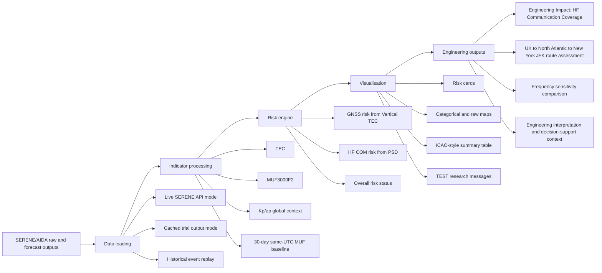

# Architecture Diagram for Dissertation

This diagram summarises the final MSc project architecture. It can be copied
into the dissertation or converted into a figure.



Decision-support flow:

```text
Risk Assessment
  -> Communication Impact
  -> Engineering Interpretation
  -> Decision Support
```

Scientific guardrail:

The current HF module is a MUF-threshold engineering proxy. It is not Trace ray
tracing and it is not operational aviation guidance. Trace integration is
documented separately in `Trace_Integration_Report.md`.
