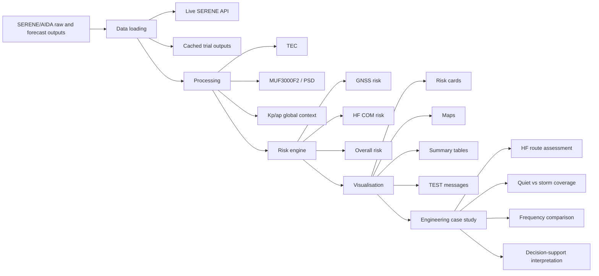
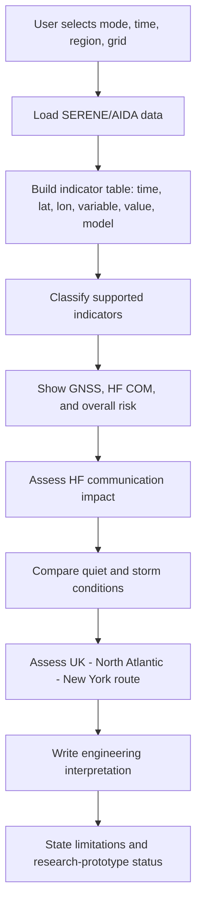

# Engineering Review and Dissertation Evidence

This document summarises the current engineering quality of the Aviation Space
Weather Risk Dashboard. It is written as evidence for the MSc Individual
Project dissertation and mid-project presentation.

## 1. Implementation Summary

The project is a Streamlit research prototype that converts SERENE/AIDA
ionospheric outputs into aviation-oriented risk information. The implemented
workflow is:

```text
SERENE/AIDA
  -> Space weather indicators
  -> Risk assessment
  -> HF communication impact
  -> Engineering interpretation
  -> Decision-support context
```

The dashboard currently supports cached trial outputs and Live SERENE API mode,
historical replay, time and region selection, grid resolution control, TEC and
MUF3000F2 visualisation, GNSS risk, HF COM risk, overall risk, Kp/ap global
context, ICAO-style summaries, forecast products, TEST research messages, and a
MUF-threshold HF communication coverage proxy.

Scientific integrity is a design constraint. The dashboard is a research
prototype only. It is not an official ICAO warning system and is not for
operational aviation use.

## 2. Modified Files and Responsibilities

Core code modules:

| File | Responsibility |
| --- | --- |
| `streamlit_cloud_github/app.py` | Streamlit application shell and page orchestration. |
| `streamlit_cloud_github/data_loader.py` | Live SERENE API loading, cached trial loading, forecast handling, and AIDA baseline comparison. |
| `streamlit_cloud_github/icao_risk.py` | GNSS, HF COM, and overall prototype risk category logic. |
| `streamlit_cloud_github/hf_coverage.py` | `HFPropagationEngine`, HF MUF-threshold coverage proxy, route metrics, and frequency comparison. |
| `streamlit_cloud_github/hf_coverage_ui.py` | Streamlit UI for the HF engineering case study. |
| `streamlit_cloud_github/validation_ui.py` | Validation checklist, assumptions, and limitations UI. |
| `streamlit_cloud_github/icao_message.py` | TEST research message generation. |
| `streamlit_cloud_github/icao_visualisation.py` | ICAO-style categorical risk maps. |
| `streamlit_cloud_github/visualisation.py` | Raw value maps and time-series plots. |
| `docs/Trace_Integration_Report.md` | hfpytrace feasibility study and scientific guardrails. |
| `prototypes/hfpytrace_uk_north_atlantic_poc.py` | Standalone Trace feasibility probe, not dashboard integration. |

## 3. Recommended Screenshots

Use screenshots as evidence, not decoration. Recommended dissertation and
presentation screenshots:

1. Sidebar controls showing Cached trial output / Live SERENE API mode, time,
   region, and grid settings.
2. Overall risk cards showing GNSS risk, HF COM risk, and overall risk.
3. ICAO-style summary table with supported indicators only.
4. Categorical risk map for TEC or PSD.
5. Raw MUF3000F2 or TEC value map.
6. HF Communication Coverage section showing UK to North Atlantic to New York
   route and coverage loss.
7. Frequency sweep table labelled as research comparison only.
8. TEST research message showing non-operational wording.
9. Validation and engineering assumptions expander.

## 4. Architecture Diagram



## 5. Workflow Diagram



## 6. Validation Summary

Validation is organised around the engineering workflow rather than only around
code execution.

- Historical replay: cached trial outputs and Live SERENE API mode can replay
  selected historical analysis windows.
- Quiet vs storm comparison: MUF3000F2 `reference_value` is preferred when the
  30-day same-UTC AIDA baseline is available.
- PSD sensitivity: the manual PSD slider is used only as a labelled fallback
  when the baseline comparison is unavailable.
- Frequency sensitivity: 5, 7.5, 10, 12.5, 15, 17.5 and 20 MHz are compared as
  research cases, and the model-preferred storm frequency is labelled as
  research decision support rather than operational advice.
- Route assessment verification: route availability, degraded route percentage,
  unavailable route percentage, degraded route points, longest degraded route
  segment, and route recommendation are reported for the UK to North Atlantic
  to New York case.
- Regression tests cover AIDA loading, cache behaviour, risk classification,
  forecast source labelling, maps, messages, trial cache handling, and HF
  coverage metrics.

## 7. Limitations

- Research prototype only; not for operational aviation decision-making.
- Not an official ICAO advisory or operational warning system.
- HF Communication Coverage is a MUF-threshold engineering proxy, not full ray
  tracing.
- No direct aviation radiation dose model is implemented.
- No S4 or sigma-phi scintillation product is available from the current
  SERENE/AIDA-only workflow.
- No direct PCA or SWF product is available from the current SERENE/AIDA-only
  workflow.
- Thresholds require scientific validation before any operational use.
- Live API mode can be slow or unavailable, so cached trial outputs are used for
  repeatable demonstrations.
- Kp/ap are global geomagnetic context and are not assigned to regional map
  cells.

## 8. Future Work

Recommended next work:

1. Run additional historical case studies and compare dashboard outputs against
   known storm periods.
2. Review GNSS and HF thresholds with literature and supervisor feedback.
3. Improve performance for denser regional grids.
4. Add exportable validation case-study summaries.
5. Build an AIDA-to-Trace electron-density converter before any dashboard Trace
   integration.
6. Keep Trace as an optional experimental case study until the input conversion
   and scientific validation are complete.

## 9. Suggested Dissertation Wording

> This project developed a Streamlit-based research prototype for aviation space
> weather risk awareness using SERENE/AIDA ionospheric model outputs. The
> software converts TEC, MUF3000F2, and global geomagnetic context into
> aviation-oriented GNSS and HF communication risk information. The main
> engineering contribution is an end-to-end decision-support workflow that links
> model outputs to risk categories, HF communication impact, route-level
> degradation metrics, and transparent research messages. The system is not an
> operational aviation warning system; it is a prototype for evaluating how
> ionospheric model outputs can be made understandable for aviation engineering
> use.

## 10. Suggested Presentation Wording

> My project is not trying to build a new physics model. It uses SERENE/AIDA
> outputs and asks an engineering question: how can these scientific outputs be
> translated into useful aviation risk information? The dashboard loads TEC,
> MUF3000F2, and Kp/ap context, converts them into supported risk indicators,
> and then adds an HF communication case study. For HF communication, I keep the
> current method honest: it is a MUF-threshold coverage proxy, not ray tracing.
> It shows quiet versus storm coverage, route degradation from the UK across the
> North Atlantic to New York, and frequency sensitivity as research comparison.
> The frequency recommendation is only a model-based decision-support output,
> not operational advice. The next step is validation, not adding unsupported
> products.
