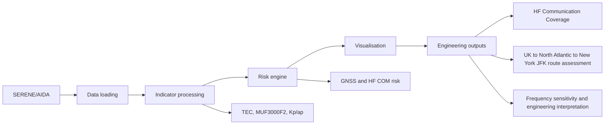

# Aviation Space Weather Dashboard Based on SERENE AIDA Data

Streamlit dissertation prototype using authenticated SERENE AIDA ionospheric
model outputs. It creates transparent, rule-based GNSS/HF risk indications from
spatial ionospheric parameters.

> Academic prototype only. It is not an official ICAO advisory system and must
> not be used for operational aviation decisions.

## Correct API data flow

```text
Streamlit Secrets
  -> GET https://spaceweather.bham.ac.uk/api/download-output/
  -> GET https://spaceweather.bham.ac.uk/api/download-forecast/ when available
  -> one raw AIDA HDF5 state per distinct requested time
  -> official AIDAState.readFile() and AIDAState.calc()
  -> exact local bounding-box/grid calculation
  -> time, lat, lon, variable, value, model DataFrame
   -> ICAO-style category maps, summary table and research text messages
```

## Engineering decision-support workflow

The final project workflow is:



The dashboard does not stop at risk categories. The intended chain is:

```text
Risk Assessment
  -> Communication Impact
  -> Engineering Interpretation
  -> Decision Support
```

Changing the map extent or spacing changes only local calculation and plotting.
It does not create one API request per point. Identical time/latency requests
are deduplicated.

The default grid is global, using latitude -90 to 90, longitude -180 to 180, and
a 15 degree grid step for aviation-scale awareness. Users can still choose a
smaller regional bounding box and finer grid step for regional analysis.

## Upstream scientific implementation

Raw-state interpretation and scientific grid calculation use Benjamin Reid's
MIT-licensed [`breid-phys/aida-ionosphere`](https://github.com/breid-phys/aida-ionosphere)
package, pinned to `v0.1.3`. The authenticated request follows its official
[`downloadOutput` implementation](https://github.com/breid-phys/aida-ionosphere/blob/v0.1.3/aida/api.py).
Nearby source comments identify every boundary that relies on this contract;
the dashboard does not copy the upstream scientific model implementation.

Supported spatial fields are `TEC`, `foF2`, `MUF3000F2` (upstream
`MUF3000`), `NmF2`, and `hmF2`. Kp/ap are global planetary indices and are
shown only as global context, never as regional map cells.

## SERENE-only ICAO-style products

The primary dashboard uses three research categories: `OK`, `MODERATE`, and
`SEVERE`. Vertical TEC uses the ICAO 125/175 TECU thresholds. The Kp auroral
absorption proxy uses Kp 8/9 and remains global. Post-storm depression uses
30%/50%, a same-UTC 30-day AIDA median, and the requirement that SERENE Kp
reached 6 during the preceding 96 hours.

`Max 3h` loads 37 five-minute AIDA analysis states. Each distinct time is
downloaded once; all regional grid cells are calculated locally.

The +90 min, +3h, and +6h columns are prediction outputs. They may come from
official SERENE AIDA forecasts when available, or from transparent
dashboard-side fallback methods such as persistence or trend-based
extrapolation. Each horizon has its own source column to avoid misrepresenting
generated predictions as official SERENE outputs.

SERENE AIDA does not currently provide amplitude scintillation S4, phase
scintillation sigma-phi, 30 MHz riometer PCA, or solar-X-ray SWF inputs. The UI
omits those unsupported products rather than displaying placeholder risk rows
or fabricating zero or `OK`.

Generated SWX text is deterministic and explicitly marked `STATUS: TEST` and
`RESEARCH PROTOTYPE - NOT FOR OPERATIONAL USE`.

## HF propagation case study

The dashboard includes an engineering HF propagation case study inspired by
the [Trace HF ray-tracing toolkit](https://pytrace.readthedocs.io/en/latest/).
It does not run full Trace ray tracing in the current prototype. Instead, it
uses MUF3000F2 to build a route-level HF communication proxy. Where AIDA
30-day same-UTC `reference_value` data is available, the section compares a
quiet/background MUF state with the storm/current MUF state. If that reference
is missing, it falls back to a clearly labelled assumed Post-Storm Depression
demonstration.

This section is intended to make the communication impact of PSD easier to
explain in the MSc project presentation. The user can select a UK transmitter,
a North Atlantic or custom target, a route frequency, and a local grid
resolution. The app samples MUF along a great-circle route, reports quiet and
storm route availability, highlights the longest degraded route segment, and
runs a small frequency sweep to identify a potentially more robust frequency
for this research case.

Coverage categories are limited to the supported MUF proxy:

- `Usable in both`
- `Degraded during storm`
- `Unusable in both`
- `Improved during storm`

The route and transmitter are illustrative, so the output remains a research
demonstration rather than an operational HF coverage product. The Trace
integration status is documented in `../docs/trace_integration_note.md`; the
optional `trace_poc_probe.py` script only checks local Trace readiness and does
not generate ray paths.

## Cached trial outputs

Selected demo / validation periods can be loaded from cached processed outputs
stored in `data/trial_outputs/`. This speeds up presentations and validation by
avoiding repeated SERENE downloads for known trial periods.

The app starts with **Cached trial output** as the loading mode. If a matching
cache folder does not exist, it falls back to **Live SERENE API** and shows a
warning. Live SERENE API mode is still available for new analysis times.

Cached outputs are research demonstration artifacts only. They must contain
processed products, indices, summary tables, and status metadata only; never
store SERENE API tokens, Streamlit secrets, raw credentials, or personal data.

To generate cache folders locally with a valid SERENE API token:

```bash
python streamlit_cloud_github/generate_trial_outputs.py --mode "Quick Demo"
```

For the slower full research product, use:

```bash
python streamlit_cloud_github/generate_trial_outputs.py --mode "Full ICAO-style mode"
```

Streamlit Cloud runtime writes are temporary. Generate cached outputs locally,
review the files under `streamlit_cloud_github/data/trial_outputs/`, then commit
them to GitHub.

If Live SERENE API loading succeeds in Streamlit Cloud, use the dashboard's
**Download cached trial output ZIP** button, then extract the ZIP so the
`<cache_key>/` folder sits under `streamlit_cloud_github/data/trial_outputs/`
before committing.

## Streamlit Community Cloud deployment

The upstream package requires `pandas<2` and `numpy<2`. Deploy with **Python
3.11**. Streamlit Community Cloud cannot change an existing app's Python version
in place, so preserve the URL and Secrets, delete the existing app, then deploy
it again and select Python 3.11 under **Advanced settings**. See the
[official Streamlit instructions](https://docs.streamlit.io/deploy/streamlit-community-cloud/manage-your-app/upgrade-python).

Use `streamlit_cloud_github/app.py` as the entrypoint and configure:

```toml
SERENE_API_BASE_URL = "https://spaceweather.bham.ac.uk"
SERENE_API_TOKEN = "your-new-api-token"
SERENE_API_TIMEOUT = "30"
SERENE_AUTH_SCHEME = "Token"
SERENE_AIDA_ARCHIVE_START = "2024-09-28T00:00:00Z"
```

Any token pasted into chat, screenshots, commits, or public files must be
revoked. Never reuse the previously exposed token.

## Verification

After deployment:

1. Click **Test SERENE API connection** and expect `Connected to SERENE AIDA raw-output API`.
2. Load a small region and confirm AIDA maps appear.
3. Confirm the table contains Latest, Max 3h, +90 min, +3h, +6h and per-horizon source columns.
4. Confirm the categorical map uses only OK/MODERATE/SEVERE (plus grey
   unavailable cells).
5. Compare 30-degree and 2-degree grids for the same analysis time. The number
   of time-product API requests must not change.
6. Confirm Kp/ap appear only in the global geomagnetic panel.

Local automated tests:

```bash
python -m unittest discover -s tests -v
```

No local scientific sample dataset is used as a silent fallback.

## Main features

- SERENE AIDA TEC and MUF3000F2 loading
- Kp/ap geomagnetic context
- GNSS risk from Vertical TEC
- HF COM risk from Post-Storm Depression
- HF propagation case study for PSD-driven communication degradation
- ICAO/PECASUS-style summary table
- Categorical risk maps
- TEST SPWX research messages
- Global default grid
- Cached trial outputs for faster demonstration
- Live SERENE API mode

## Limitations

- Research prototype only
- Not for operational aviation use
- No direct radiation dose product
- No S4 / sigma-phi scintillation input from SERENE-only data
- No direct PCA / SWF product from SERENE-only data
- Forecasts may be official SERENE forecasts or clearly labelled
  dashboard-generated fallback predictions
